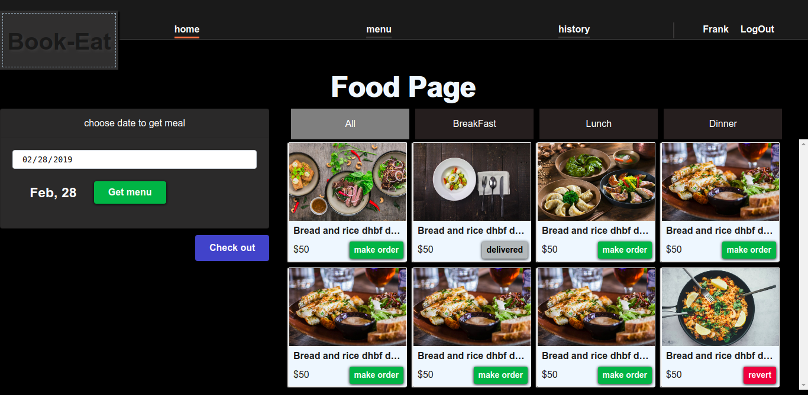

## Table of contents

* [General info](#general-info)
* [Book-Eat](#book-a-meal)
* [Technologies](#technologies)
* [Code style](#code-style)
* [UI Template and Theme](#ui-theme)
* [gh-pages](#gh-page)
* [Trello board](#trello)
* [Setup](#setup)
* [Test](#test)
* [Code coverage](#code-coverage)
* [License](#license)


# Book-Eat

Book-Eat is a food booking App. Is one of a kind food software application that solves the problem
accessibility of good and well prepared hygienic meal.

it as easy as logining into the application and selecting a meal prepared by the world 
best chefs in your area.

### Technologies 

This is a simple food app created with love and -
 - Node 
 - React
 - Postgres.

### Code style 
Airbnb

### UI Template and Theme 
A dark theme was used in this project.
this was done to make the images of the well prepared meal 
to be the main focus.

---

image preview
	

---

### gh-pages 
- [index page](https://frankchinedu.github.io/book_a_meal_ALC/front/UI/index.html)
- [order page](https://frankchinedu.github.io/book_a_meal_ALC/front/UI/orderPage.html)
- [checkout page](https://frankchinedu.github.io/book_a_meal_ALC/front/UI/checkoutPage.html)
- [receipt](https://frankchinedu.github.io/book_a_meal_ALC/front/UI/receipt.html)
- [confirmation page](https://frankchinedu.github.io/book_a_meal_ALC/front/UI/confirmation.html)
- [food page](https://frankchinedu.github.io/book_a_meal_ALC/front/UI/foodPage.html)


### Trello board 
[trello board](https://trello.com/b/M3NM9KbQ/book-a-meal-alc)


### Setup 
To run this project, install it locally using npm:

##### For server

```
$ cd back
$ npm install
$ npm start
```


### Test 
Test framework used mocha and chai
run by simply

```
$ npm test
```

### Code coverage
[](https://coveralls.io/github/FrankChinedu/book_a_meal_ALC?branch=master)

#### travis
[](https://travis-ci.com/FrankChinedu/book_a_meal_ALC)


### License 
This project is licensed under the MIT License.

MIT © Obi chinedu Frank
